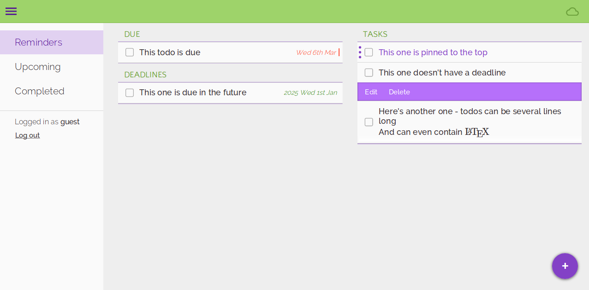

# Reminders

A to-do list web app focusing on robust offline and multi-device operation, and taking advantage of modern web technologies.

Hosted at <https://reminders.thjread.com> on Google Cloud Platform Free Tier (see <https://github.com/thjread/thjread> for full NGINX and Docker Compose configuration), using CloudFlare to cache static content.

### Features

* Progressive web application -- uses service workers to work offline, and can use as a standalone application on mobile (click 'Add to Home Screen')
* Push notifications
* Responsive design on desktop and mobile
* Enter deadlines in human-readable form e.g. "tomorrow", "3pm Tuesday" "in 10 minutes" with [Sugar](https://sugarjs.com/)
* Pin to-dos to the top of the list to mark them as needing attention
* Touch gestures on mobile -- swipe right to mark as done, long press to pin
* Keyboard shortcuts
* Undo last action
* Maths rendering with [KaTeX](https://katex.org/)
* Fluid CSS animations
* Uses modern web security technologies such as a restrictive Content Security Policy

### Technologies

**Frontend**:

* Written in [TypeScript](https://www.typescriptlang.org/) and packaged using [webpack](https://webpack.js.org/)
* State management with [Redux](https://redux.js.org/)
* Uses the lightweight [Mithril](https://mithril.js.org/) Single Page Application framework
* Offline user actions stored in localStorage

**Backend**:

* Application server written in Rust using the [actix-web](https://actix.rs/) framework
* PostgreSQL integration with the [diesel](http://diesel.rs/) ORM
* Stateless authentication using [JSON Web Tokens](https://jwt.io/)
* Push notifications with the Web Push API
* Automated database backups to an Amazon S3 bucket

### Running

Requires:

* npm
* Rust
* A local PostgreSQL database
* Diesel CLI
  (``cargo install diesel_cli --no-default-features --features "postgres"``)

**Frontend**:

```sh
cd Frontend/reminders
npm install && npm start # start an npm server on localhost:8000
```

**Backend**: 

```sh
cd Backend/reminders-server
sh keygen.sh # create a JSON Web Token secret key, and a VAPID keypair for web push notifications
diesel setup # create a database named db, and set up the schema.
cargo run    # start the backend server on localhost:3000
```

### Screenshots



  
